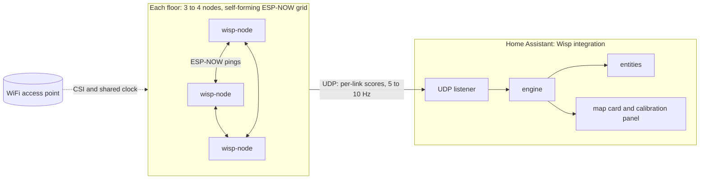

# Wisp architecture

Decisions taken before the first line of code. Sections marked **proposed** are designs still to be agreed; open items are listed at the end.

## Goal

Room presence and an x/y position per floor, from the WiFi links between cheap ESP32 nodes, inside Home Assistant. Local only, installable from HACS, nodes flashed from the browser.

**The firmware is the core.** It must be as light and fast as possible, run on the cheapest ESP32 boards, and form a robust grid over ESP-NOW by itself, with no pairing and no leader.

## Overview



## Where the processing happens

Sensing on each node, fusion in one central place.

| On each node (the core) | Central (the engine) |
|---|---|
| Join the grid, keep its slot, stay in sync | Combine every link of a floor at once |
| Capture CSI from the other nodes and the AP | Floor plan, node positions, link geometry |
| Per-link disturbance score and baseline | Calibration and training data |
| Optional local motion yes/no | Tracking, room snapping, entities, UI |
| Shrink everything to tiny packets | |

Fusing links into a position needs all links together, plus the map and calibration data. A node acting as "leader" could do it, but calibration, UI and updates would become painful.

## Options considered

| | A. Nodes + HA integration | B. Nodes + Docker + MQTT + HA | C. Brain on the nodes only |
|---|---|---|---|
| Moving parts | Fewest | Most | Few, but complex firmware |
| Setup for users | HACS install, auto-discovery | Docker, MQTT and HA | Flash and go, limited setup |
| Map and calibration UI | HA panel and card | Own web UI | Very hard |
| Compute headroom | Fine for this maths | Most (heavy ML) | Limited |
| HA restart | Sensing pauses | Keeps running | No impact |
| Works without HA | No | Yes | Yes |
| Reusable via HACS | Yes | Partly | No |

**Decision: A, built to allow B.** The engine is a pure Python library with no Home Assistant imports, so the same code can later run as a Docker service with MQTT for non-HA users or heavier ML.

## Node firmware (`wisp-node`)

- ESP-IDF in C. No Arduino, no allocation in the hot path.
- Any cheap ESP32 with WiFi CSI. ESP32-C3 and ESP32-S3 first; others may follow.
- BSSID lock to one access point, UDP to Home Assistant, mDNS announcement with the firmware version.
- Improv Serial, so the web flasher can set WiFi credentials.
- OTA updates, so the web flasher is only needed once.

### Lean by design

- The CSI callback only copies the subcarriers it needs into a ring buffer and returns.
- A low-priority task turns them into amplitudes (integer maths), a running baseline and a disturbance score per link.
- One UDP packet per round carries all of a node's links, a few bytes each.
- Budget: comfortable on a single-core ESP32-C3.

### Grid formation (proposed)

The grid forms and heals itself. Nothing to pair, no master node.

- **One channel.** Every node joins the same access point to reach Home Assistant, so all share its channel, and ESP-NOW runs on that channel.
- **Discovery.** Each node broadcasts a tiny ESP-NOW beacon: node id, chip, firmware version, health. The nodes heard recently are the members; a node silent for a few rounds drops out.
- **Shared clock without a leader.** The access point's beacon timer (TSF) is the same on every connected node. Time slots come straight from it: a fixed round (for example 100 ms), and each node's slot is its rank in the member list sorted by MAC. If two nodes briefly disagree on the list, the worst case is a collision that the radio's own carrier sense and the next round absorb.
- **One broadcast per node per round.** Every other node captures CSI from it, so N broadcasts measure N × (N - 1) directed links. Four nodes at 10 Hz is 40 small frames a second for 12 links.
- **Self-healing.** Nodes can join or leave at any time; see below.

### Adding and removing nodes (proposed)

Nodes come and go: a reboot, a dead USB charger, a new node for another room, a board swapped for a better one. None of this should need a restart or a full recalibration.

- **Stable identity.** A node's id comes from its MAC, so it survives reboots and reflashing. A link is the pair (sender, receiver), so its history and calibration stay tied to the same two nodes.
- **Grid.** Membership is just "who was heard recently". A node joining or leaving changes the sorted member list, every node recomputes its slot, and the grid settles within a round or two. The round has a fixed number of slots, so adding nodes never changes the round length.
- **Engine.** Everything works on whatever links are live right now. Room models are trained per link, so a missing link is skipped and confidence drops a little, rather than the whole floor failing.
- **A node goes quiet.** Its links become unavailable and its health entity goes offline. It stays part of the setup, keeping its position and calibration, so when it returns it is used again straight away. Home Assistant raises a repair issue if it stays away for a long time.
- **A new node appears.** Home Assistant discovers it and asks for its floor. Its position is first guessed from its ranges to nodes that are already placed (easier than placing a whole floor from scratch), then confirmed on the floor plan. Its new links feed the raw link sensors at once, and join the room models after a short top-up calibration or once auto-baseline has learned them.
- **A node is replaced.** A "replace node" action moves the old node's position, floor and name to the new one. Its links still need to learn their own baseline.
- **A node is removed for good.** Only by the user, by deleting the device in Home Assistant. Its links and calibration data are dropped.

### Node placement (proposed)

Nodes can estimate where they are, but not precisely enough to skip the user. Auto-placement gives a first guess that the user confirms on the floor plan. Room presence (phase 2) uses fingerprints and does not need node positions at all; only x/y (phase 3) does.

1. **Floors.** Links between floors are much weaker than links within a floor, so clustering the signal strength graph splits nodes into floors.
2. **Distances.** Each pair of nodes measures its range. Wi-Fi FTM (round trip time) where the chip supports it (ESP32-C2, C3, S2, S3, and C6 from chip revision 0.2): about 1 to 3 m indoors after an offset calibration. Signal strength with a fitted path loss model as the fallback (original ESP32), much rougher.
3. **Layout.** The engine runs weighted multidimensional scaling (SMACOF) on the distance matrix. The result is a relative layout, right up to rotation, mirror and shift.
4. **Anchor.** The user drags two nodes onto the floor plan, plus one tap to flip the mirror if needed. The rest snap into place and can be nudged. Positions the user sets always win.
5. **Watch.** Ranges are re-measured now and then; a large change raises a "node moved?" warning.
6. **Later.** Refine from people walking: the order in which links react as someone crosses them constrains the geometry.

## Engine (`custom_components/wisp/engine/`)

Pure Python, unit tested, no HA dependency: link geometry, node layout, tomographic imaging matrix, calibration, tracking filter, room snapping.

## Home Assistant integration (`custom_components/wisp/`)

Discovers nodes, config flow, UDP listener, runs the engine, and creates the entities: room, x and y per floor, presence per room, node health and BSSID. Floor, node position and BSSID lock are set here, not in the flasher.

## Frontend

- `wisp-map-card`: live footprints on an SVG floor plan.
- Calibration panel: place nodes on the floor plan, run the calibration walk.

Both ship inside the integration and register themselves, so one HACS install brings everything.

## Web flasher (`docs/flasher/`)

[ESP Web Tools](https://esphome.github.io/esp-web-tools/), the flasher ESPHome uses, hosted on GitHub Pages at `albert-canfield.github.io/wisp`. It needs Web Serial (Chrome or Edge on desktop).

1. Plug in the board, click Install, pick the port. The right build is chosen from the chip.
2. After flashing, the page asks for WiFi credentials over Improv Serial.
3. The node joins WiFi, announces itself over mDNS and Home Assistant discovers it.

The manifest points at one merged `factory.bin` per chip (bootloader, partition table and app) at offset 0. A GitHub Actions workflow, triggered by a version tag, builds the firmware with `espressif/esp-idf-ci-action`, merges the binaries with `esptool.py merge_bin`, writes the version into `manifest.json`, publishes `docs/flasher` to GitHub Pages and attaches the binaries to the release.

## Transport

Nodes send UDP, not MQTT. About 4 nodes × 3 links × 10 Hz is roughly 120 tiny messages a second, which UDP handles with less overhead and no broker. MQTT is only for publishing results, in the optional Docker setup.

## Naming

| Thing | Name |
|---|---|
| Full title | Wisp: WiFi Spatial Presence |
| Repository | `albert-canfield/wisp` |
| HA domain | `wisp` |
| Entities | `sensor.wisp_floor_2_room`, `binary_sensor.wisp_office_presence`, `sensor.wisp_floor_1_x` |
| Firmware | `wisp-node` |
| Card | `wisp-map-card` |

"WISP" also means wireless ISP, so the full title is used wherever people search.

## Repository layout

```
wisp/
  firmware/                  wisp-node, ESP-IDF project (the core)
  custom_components/wisp/
    engine/                  pure Python: geometry, layout, imaging, calibration, tracking
    frontend/                wisp-map-card and calibration panel
    brand/                   icons and logos
  docs/
    ARCHITECTURE.md
    flasher/                 web flasher (GitHub Pages)
  .github/workflows/         validation, tests, firmware build and Pages
```

## Phases

1. **Prove the signal** (one floor, 3 to 4 nodes). Firmware: self-forming grid, slotted pings, CSI, BSSID lock, per-link scores over UDP, Improv Serial, web flasher. Integration skeleton: discover nodes, receive UDP, per-link disturbance sensors. Done when links react as you walk between nodes.
2. **Room presence.** Floor plan and node placement (auto first guess, user confirms), calibration walk per room, fingerprint classifier. Entities: room per floor, presence per room, confidence.
3. **Position and map.** Tomographic imaging, a tracking filter with walls, the map card.
4. **Polish for HACS.** Config flow, OTA, diagnostics, documentation, automatic baseline.

## Open questions

- UDP packet format and versioning.
- ESP-NOW beacon and ping format, round length, how many rounds before a node drops out.
- Which CSI features feed the disturbance score (amplitude variance, subcarrier selection, phase).
- Whether FTM ranging can share the radio with the ping schedule, or runs in a separate setup window.
- Slots per round (the maximum number of nodes on one channel).
- Mesh WiFi homes: nodes locked to access points on different channels cannot hear each other over ESP-NOW and would form separate grids.
- Calibration walk flow in detail.
- Multiple people on one floor.
