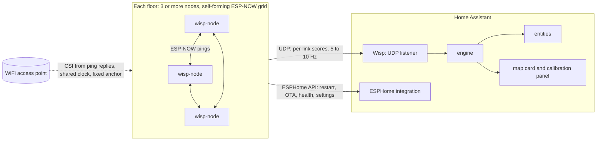

# Wisp architecture

Decisions taken before the first line of code. Sections marked **proposed** are designs still to be agreed; open items are listed at the end.

## Goal

Room presence and an x/y position per floor, from the WiFi links between cheap ESP32 nodes, inside Home Assistant. Local only, installable from HACS, nodes flashed from the browser.

**The firmware is the core.** It must be as light and fast as possible, run on the cheapest ESP32 boards, and form a robust grid over ESP-NOW by itself, with no pairing and no leader. Nodes join, leave and heal on their own, without Home Assistant.

- **At least 3 nodes per floor.** More nodes give more links and better precision.
- **The access point takes part.** Nodes capture CSI from the WiFi access point as well as from each other. The AP is a fixed point on the floor plan, so it adds links and makes positions more precise.
- **Built on ESPHome.** Home Assistant restarts, updates and configures nodes through the ESPHome API and OTA, like any ESPHome device. Wisp's core runs inside as an ESPHome external component.

## Overview



## Where the processing happens

Sensing on each node, fusion in one central place.

| On each node (the core) | Central (the engine) |
|---|---|
| Join the grid, keep its slot, share the hive knowledge and layout | Combine every link of a floor at once |
| Capture CSI from the other nodes and the AP | Floor plan, node positions, link geometry |
| Per-link disturbance score and baseline | Calibration and training data |
| Optional local motion yes/no | Tracking, room snapping, entities, UI |
| Shrink everything to tiny packets | |

Fusing links into a position needs all links together, plus the map and calibration data. A node acting as "leader" could do it, but calibration, UI and updates would become painful.

## Options considered

| | A. Nodes + HA integration | B. Nodes + Docker + MQTT + HA | C. Brain on the nodes only |
|---|---|---|---|
| Moving parts | Fewest | Most | Few, but complex firmware |
| Setup for users | HACS install, auto-discovery | Docker, MQTT and HA | Flash and go, limited setup |
| Map and calibration UI | HA panel and card | Own web UI | Very hard |
| Compute headroom | Fine for this maths | Most (heavy ML) | Limited |
| HA restart | Sensing pauses | Keeps running | No impact |
| Works without HA | No | Yes | Yes |
| Reusable via HACS | Yes | Partly | No |

**Decision: A, built to allow B.** The engine is a pure Python library with no Home Assistant imports, so the same code can later run as a Docker service with MQTT for non-HA users or heavier ML.

## Node firmware (`wisp-node`)

Built on [ESPHome](https://esphome.io) with the ESP-IDF framework. ESPHome handles everything around the core; Wisp's own code is an ESPHome external component (`wisp`) in C++.

| From ESPHome | Wisp's core (external component) |
|---|---|
| WiFi, fallback hotspot and captive portal | Grid formation, slots and node lifecycle |
| Native API to Home Assistant: entities, restart, settings | ESP-NOW pings and the hive |
| OTA from Home Assistant, the ESPHome dashboard or a manifest on GitHub Pages | CSI capture from nodes and APs, AP grouping |
| Web server, Improv Serial (and Improv over Bluetooth) | Per-link scores and baseline |
| Safe mode, status LED, logger, mDNS | UDP link stream to the Wisp integration |

- Any cheap ESP32 with WiFi CSI. Builds for ESP32-S3, ESP32-C3 and the original ESP32; others may follow. First test nodes: two ESP32-S3 N16R8 (16 MB flash, 8 MB PSRAM).
- CSI from the other nodes (ESP-NOW) and from the access points (ping replies and beacons), each AP told apart by its BSSID.
- BSSID lock to its home access point.

**Why ESPHome.** Home Assistant already discovers, restarts, updates and configures ESPHome devices, and users know the flow. It costs some flash and RAM, but saves writing and maintaining WiFi handling, OTA, an API, a web server and the fallback hotspot. The core stays lean inside it.

### Lean by design

- The core runs in its own FreeRTOS task, not in ESPHome's main loop, so slot timing does not depend on what else ESPHome is doing.
- The CSI callback only copies the subcarriers it needs into a ring buffer and returns.
- A low-priority task turns them into amplitudes (integer maths), a running baseline and a disturbance score per link.
- One UDP packet per round carries all of a node's links, a few bytes each.
- Link data goes over UDP, not the ESPHome API: 10 updates a second for every link would flood Home Assistant's state machine and recorder. The API only carries slow things: health, settings and buttons.
- Budget: ESPHome plus the core comfortable on a single-core ESP32-C3.

### Grid formation (proposed)

The grid forms and heals itself. Nothing to pair, no master node.

- **One channel.** ESP-NOW only works between nodes on the same channel, so the grid has one 2.4 GHz channel. Every node joins an access point on that channel (with several APs, not necessarily the same one).
- **Discovery.** Each node broadcasts a tiny ESP-NOW beacon: node id, chip, firmware version, health. The nodes heard recently are the members; a node silent for a few rounds drops out.
- **Shared clock without a leader.** An access point's beacon timer (TSF) is the same on every node that hears it. With several APs each has its own, so the hive picks one clock AP: the one heard by every node, lowest BSSID on a tie. Time slots come straight from it: a fixed round (for example 100 ms), and each node's slot is its rank in the member list sorted by MAC. If two nodes briefly disagree on the list, the worst case is a collision that the radio's own carrier sense and the next round absorb.
- **One broadcast per node per round.** Every other node captures CSI from it, so N broadcasts measure N × (N - 1) directed links. Three nodes at 10 Hz is 30 small frames a second for 6 node links, plus 3 access point links (below).
- **Self-healing.** Nodes join, leave and recover on their own; see the node lifecycle and self-healing below.

### The access point as a fixed node (proposed)

The access point is a free extra point in the grid: always on, never moves, and its place on the floor plan is marked once. Three nodes plus the AP make four points and six lines across the floor instead of three.

- **Its signal.** In its own slot, each node pings the router. The reply comes from the locked access point and carries CSI for the AP to node link, the method Espressif's own `csi_recv_router` example uses. Beacons alone are not enough: they come only about 10 times a second, and many access points send them at the slowest legacy rate, which carries little or no CSI.
- **Optional extra.** Frames the AP sends to other devices can be captured too (promiscuous mode, filtered by its BSSID). One such frame measures every AP link at the same instant.
- **In the hive.** The AP is a column without a row: every node reports what it hears from the AP, the AP reports nothing. Ranks are taken per sender, so the AP's different transmit power does not matter.
- **Better anchoring.** With the AP's position known, placing one node (plus a mirror flip) fixes the whole layout, instead of two.
- **Distance in metres.** If the access point is an FTM responder (802.11mc; some recent routers are), nodes range to it directly, the strongest anchor there is.
- **AP on another floor.** It still gives the clock and the connection, but its links say less about position on this floor, so the engine weighs them down.

**Why it matters most on small grids.** N nodes have N × (N - 1) / 2 lines between them; the AP adds N more, all fanning out from one fixed point at new angles.

| Nodes | Lines without AP | Lines with AP | Gain |
|---|---|---|---|
| 3 | 3 | 6 | double |
| 4 | 6 | 10 | +67% |
| 5 | 10 | 15 | +50% |
| 6 | 15 | 21 | +40% |

**More from the router connection.**

- **Clean snapshots.** One frame from the AP reaches every node at the same instant, so all AP links are measured together, with no slot timing between them.
- **Drift reference.** The AP is mains powered and never moves. When every AP link drifts the same way at once (temperature, humidity, a door left open), that is the environment, not a person, and the engine corrects the baseline.
- **The AP's own view.** Many routers already report the signal they receive from each client (UniFi, OpenWrt and Fritz!Box all have Home Assistant integrations that expose it). That fills in the AP's missing row, slowly but for free.
- **Later: other fixed WiFi devices.** A smart TV, a speaker or a smart plug talks to the AP on the same channel all day. Nodes can capture CSI from their frames too (promiscuous mode, filtered by MAC), turning each fixed device the user picks into another free transmitter with more lines. Only devices the user selects, never phones.

**Caveats.** Modern access points change data rate and transmit power, and beamform towards the clients they serve, so CSI from the AP can change without anyone moving. The engine treats AP links as their own class with their own baseline, and prefers the replies to each node's own pings (an ESP32 does not ask for beamforming) over frames meant for other devices.

### Several access points (proposed)

Many homes have more than one access point under the same WiFi name: a mesh system, or several APs on one controller. Each AP radio has its own MAC address (BSSID), so nodes can tell them apart, and every AP becomes another fixed point.

**Built so far:** the grid channel (below), and each node's own AP as its CSI source, from the replies to its pings. **Planned:** the rest of this list.

- **Telling APs apart.** One physical AP often has several BSSIDs on the same radio (main, guest and IoT networks). Nodes group BSSIDs into one AP when they share the channel, their MACs differ only in the last digits or the "locally administered" bit, and every node hears them at the same strength. Each physical AP gets an id in the hive (AP1, AP2, AP3).
- **Recognising them in Home Assistant.** Each AP is listed with its BSSIDs and the node that hears it best, so the user can tell which is which and mark it on the floor plan once.
- **Home AP per node.** Each node locks to the strongest AP on the grid channel. The hive spreads the nodes' home APs across the APs, so every AP sends regular ping replies.
- **Overhearing.** Ping replies from AP2 to node B also reach nodes A and C (promiscuous mode, filtered by BSSID). So every AP on the grid channel is a live CSI source for every node, not only for the nodes it serves.
- **Signal from all of them.** Every node reports every AP it hears in its hive row. Beacons give signal strength from all APs, and CSI too when the APs send them at OFDM rates (see the settings below): then every AP is a CSI source about 10 times a second per network name, with no pings at all.
- **Full anchoring.** With three APs marked on the floor plan, the layout is fixed with no node dragging and no mirror flip, and new nodes place themselves.
- **Roaming.** Mesh systems push clients to "better" APs. Nodes ignore steering requests and keep their lock. If an AP keeps disconnecting a node, the hive gives the node another home AP on the grid channel.
- **APs come and go too.** An AP rebooting, added or removed goes through the same lifecycle as a node: new, missing, forgotten.

**Grid channel (built).** Every node applies one rule to the APs of its own network that it heard while connecting: the grid channel is the channel of the lowest BSSID heard at -80 dBm or better, and the node joins the strongest AP on that channel. The choice is saved, and that AP gets a one-step priority boost in ESPHome's AP ranking, so later boots join it directly; one failed attempt puts it level with the others again, so a dead AP never strands a node. A node that lands on another channel disconnects once and lets ESPHome reconnect with the boost (at most three times per boot). ESPHome's own roaming is off. Each node's "Fixed grid channel" setting (0 automatic, 1 to 13) overrides the rule at once, without new firmware: the Wisp panel sets it for all nodes of a floor, so a home with an access point per floor can keep each floor's grid on its own access point and channel (nodes otherwise pick up the access point of another floor and sense across floors). `grid_channel` in the YAML gives the setting's first value. In the owner's home (APs on 1, 6 and 11) both test nodes moved to channel 1 and formed a grid.

**Same channel or not.** Best results come when every AP's 2.4 GHz radio uses the same channel: then each node joins its nearest AP, so every AP serves the nodes around it. If they use different channels, nodes stay on the grid channel; APs on other channels only contribute signal strength from a quick scan every few minutes, which helps placement but not live sensing. The setup flow shows which case a home is in and what moving the APs to one channel would gain.

**Access point settings that help.** None are required; each one makes sensing better. Example names are from TP-Link Omada.

| Setting | Why | In Omada |
|---|---|---|
| Same fixed 2.4 GHz channel on every AP (1, 6 or 11, 20 MHz) | Each node joins its nearest AP | Devices > AP > Config > Radios |
| Fixed 2.4 GHz transmit power, not auto | Automatic power changes look like people moving | Same place |
| Disable 802.11b (CCK) rates, keep beacons above 1 Mbps | Beacons and management frames then carry CSI | WLAN > SSID > 802.11 Rate Control |
| No automatic channel changes on 2.4 GHz | Every change forces the grid to move channel | Channel and WLAN optimisation settings |
| No minimum signal kick or load balancing on the nodes' network | Stops APs disconnecting weak nodes | SSID advanced settings |

Disabling 802.11b rates only locks out devices that support nothing newer, which are rare today. A separate 2.4 GHz network just for the nodes (it can be hidden) avoids touching the main WiFi at all, since every network name sends its own beacons.

### Node lifecycle (proposed)

Nodes come and go: a reboot, a dead USB charger, a new node for another room, a board swapped for a better one. The firmware handles all of it by itself; Home Assistant follows and never has to step in.

- **Stable identity.** A node's id comes from its MAC, so it survives reboots and reflashing. A link is the pair (sender, receiver), so its history and calibration stay tied to the same two nodes.
- **New.** A node heard for the first time listens for a few rounds: it copies the hive from its neighbours and picks up the clock. Then it takes a slot and starts pinging. The hive places it against the existing layout straight away.
- **Active.** Heard in recent rounds. Its slot, links and row are live.
- **Quiet** (missed a few rounds, about a second). Its slot is freed and its links are marked stale. Everything else is kept, so a reboot costs nothing.
- **Missing** (quiet for minutes). Its position and calibration are kept and the layout holds it in place. Its health shows missing.
- **Forgotten** (missing for a long time, for example a day). The hive drops its row and links, compacts the slots and re-solves the layout. Every node decides this on the same timers from the shared clock, so they agree without voting.
- **Back.** A node that returns before it is forgotten resumes at once. After that, it joins as new, and Home Assistant can still restore its old position by its MAC.

The grid round has a fixed number of slots, so nodes joining or leaving never change the round length. The engine works on whatever links are live right now and trains room models per link, so a missing link costs a little confidence, never the whole floor.

Home Assistant mirrors the lifecycle: it creates a device for a new node and asks for its floor, shows quiet and missing nodes as offline, and marks forgotten ones. A "replace node" action moves an old node's position, floor and name to a new board; its links still learn their own baseline.

### Self-healing in the firmware (proposed)

Each node keeps itself and the grid running without Home Assistant.

- **Clock.** If the clock AP disappears (a reboot), the hive picks another AP every node hears. If none is left, nodes keep their slots on their own timers and the lowest MAC node's beacon becomes the temporary clock until an AP returns.
- **Channel changes.** If the AP comes back on another channel, nodes reconnect and ESP-NOW follows. A node that has lost the grid scans the channels for hive beacons.
- **WiFi.** Reconnect with backoff, keeping the BSSID lock. Unsent UDP data is dropped when stale: fresh data wins.
- **Memory of the hive.** Rows, layout and anchor are saved to flash (NVS) every few minutes and on big changes, limited to spare the flash. After a reboot a node rejoins with full knowledge in about a second.
- **Watchdogs.** Task and hardware watchdogs on the CSI, radio and network tasks, plus brownout detection. Reboot reasons and counts go into the health data.
- **Safe updates.** ESPHome's safe mode: after repeated failed boots the node starts a minimal firmware mode that only accepts OTA, so a bad update can always be replaced over the air.
- **Fixed memory.** Static buffers, no heap churn. The lowest free heap is reported.
- **Conflicts.** Two nodes claiming the same slot or short id are resolved by MAC order. A hive hash that disagrees for too long triggers a full resync from a neighbour.
- **Capacity.** When every slot is taken, extra nodes stay as listeners: they still capture CSI from the others but do not ping.

### Setup, fallback and remote control (proposed)

A node is never stuck, and never needs a ladder to reach it.

**Getting WiFi details in**, all standard ESPHome:

1. **Web flasher.** Improv Serial over USB, right after flashing.
2. **Fallback hotspot.** A node that cannot connect opens its own hotspot `wisp-xxxxxx` (named after the node, with the last six MAC digits) after a minute (ESPHome `ap` and `captive_portal`). Joining it opens the setup page by itself. The node keeps retrying its saved WiFi in the background and closes the hotspot once connected.
3. **Improv over Bluetooth**, if it fits in the C3's RAM: Home Assistant offers to set up a new node straight from its discovery prompt.
4. **BOOT button.** Hold for 10 seconds for a factory reset.

**Remote control from Home Assistant**, through the ESPHome API:

- **Restart**, **Safe mode** (boot into the OTA-only mode) and **Factory reset** buttons on every node.
- **Firmware update** entity: each node checks the manifest on GitHub Pages (ESPHome `update` with `http_request`), Home Assistant shows "update available" for every node, and one click updates it. OTA from the ESPHome dashboard or command line works too.
- **Settings as entities:** floor, name, lifecycle timers and developer switches, so they appear in Home Assistant and on the node's web page alike.

**Security.** ESPHome API encryption key and OTA password, set per install. The fallback hotspot and the web server get a password once the node is set up.

**While WiFi is down the node waits, it does not reboot.** ESPHome keeps scanning every channel to reconnect, and after 90 s opens the fallback hotspot, so the grid pauses: beacons go out on whatever channel the radio is on, and nothing reaches Home Assistant anyway, since reports go over WiFi. On reconnecting, the node re-arms CSI and ESP-NOW, steers back to the grid channel and the hive resyncs within seconds; the CSI and beacon watchdogs catch anything a Wi-Fi restart left disarmed. Stretch goal: a neighbour that is still connected forwards the node's data to Home Assistant over ESP-NOW.

**Self-healing, in the firmware:** a beacon watchdog restarts ESP-NOW after 10 s without a beacon sent and re-arms the slot timer if it stopped; a CSI watchdog re-arms CSI and restarts the gateway pings after 30 s without a frame from the access point (waits doubling to 10 min for a gateway that never answers); a node alone on the grid for 5 min in a network with several channels reconnects to re-check the grid channel (waits doubling to 6 h); the saved grid access point survives two scans that miss it; and the core task runs under the task watchdog.

### Web interface (proposed)

Every node runs ESPHome's web server at `http://wisp-xxxxxx.local` and on its fallback hotspot. It shows every entity, the logs and an OTA upload with no extra work. Wisp adds its own entities:

| Group | Entities |
|---|---|
| Status | Firmware, chip, uptime, home AP (BSSID, channel, signal), free memory, last reboot reason |
| Grid | Members and their lifecycle state, slot, clock AP, hive hash, APs seen (grouped BSSIDs), live link scores |
| Node | Name, floor, identify (fast LED blink), forget a node |
| Developer | Raw CSI streaming to a PC on or off |

Later, a small script added to the page (ESPHome `js_include`) draws the hive's layout as a map. Home Assistant stays the main place for floors and positions; the web page is for setup, checks and running without Home Assistant.

### Also in the first firmware (proposed)

- **Status LED.** ESPHome status LED for connecting, fallback hotspot and errors; the grid state on top. On the S3 test board, its RGB LED.
- **Raw CSI streaming.** A developer switch that streams raw CSI over UDP to a PC, plus a small Python script to record and plot it. Phase 1 needs real recordings to tune the disturbance score.
- **Radio settings for clean CSI.** CSI enabled in the ESP-IDF config (`CONFIG_ESP_WIFI_CSI_ENABLED`). WiFi power save off (`power_save_mode: none`), since it breaks CSI timing and ESP-NOW reception. ESP-NOW pings at one fixed 802.11n rate, so every ping carries the same kind of CSI. WiFi country taken from the AP, so channels 12 and 13 work in the UK and Europe.
- **Versioned packets.** Every UDP and ESP-NOW packet starts with a protocol version, node id and sequence number. Unknown versions are ignored safely and reported.
- **One build per chip.** ESPHome's standard OTA partition layout for 4 MB flash, so one build fits every board of that chip; bigger boards simply have room to spare.
- **Discovery.** Home Assistant finds nodes through ESPHome's own discovery. The Wisp integration recognises them by the ESPHome project name `albert-canfield.wisp-node` and attaches its entities to the same device.
- **Build and release.** CI builds the C3 and S3 firmware with ESPHome on every push; a version tag publishes the release, the web flasher and the update manifest on GitHub Pages.

### Shared grid knowledge: the hive (proposed)

Every node holds the same picture of the whole grid, like a honeycomb memory. A new node learns everything from any neighbour within a few rounds, and the grid keeps its layout even while Home Assistant is down.

- **Each node shares its own row.** The ping every node already broadcasts each round (for CSI) also carries what that node hears from each neighbour: a slow median signal strength, plus an FTM range where available. About 4 bytes per neighbour, so 16 neighbours fit easily in one ESP-NOW frame. No extra frames.
- **Rows circulate.** Each row has a version number; nodes keep the newest row from every origin. Every ping also relays one other node's row in rotation, so the matrix reaches nodes that cannot hear each other directly.
- **Agreement without a leader.** Each ping carries a short hash of the matrix the sender holds. Same hash, same knowledge, same layout, because the solver is deterministic (inputs ordered by node id, fixed start, coordinates rounded to 10 cm so chips with and without an FPU agree).
- **Ranks over raw dB.** Cheap boards differ in antenna and power. The solver turns each node's readings into an order ("B and C stronger, D weaker"), which cancels those differences. Combining both ends of every link adds robustness.
- **Ageing.** Rows follow the node lifecycle: stale when their origin goes quiet, position kept while it is missing, dropped once it is forgotten.

Example: four nodes report only stronger or weaker.

| Node | Stronger | Weaker |
|---|---|---|
| A | B, C | D |
| B | A, D | C |
| C | A, D | B |
| D | B, C | A |

Every node computes the same plausible layout (or its mirror image, until anchored):

```
          B

A                 D

          C
```

**Maths, light enough for a node.**

- **Classical MDS** (Torgerson) gives the layout in one step: double-centre the squared distance matrix and take its two leading eigenvectors (power iteration). No iterations that can get stuck in a wrong fold. For 16 nodes this is a few thousand multiply-adds, milliseconds even with software floats on an ESP32-C3.
- **SMACOF**, warm-started from that result, refines it in a few steps and handles noisy and missing links with weights.
- **A new node** is placed against the existing layout by least squares on its own distances (two unknowns), without re-solving the whole grid.
- **Recompute only when the matrix changes** by more than a threshold, and only while the house is quiet, because people moving is exactly the signal the sensing uses.
- **Limits.** Signal strength measures radio distance, not metres: a node behind a thick wall looks further away than it is. FTM ranges and the user's anchor correct that.
- **Built (0.1.5): the exponent is chosen per hive.** Indoors, walls and board-to-board differences make the metric distances break the triangle inequality, and then the least-stress layout is a line (the owner's 4 nodes: 0.8 m, 1.7 m and 4.8 m for one triangle). The solver now tries six path-loss exponents, from 7.8 (distances squeezed together) down to 2.56, each continuing from the last: classical MDS of the most squeezed distances, then 10 SMACOF steps with relative weights (1/d^2) per exponent, each scored by its mean square error in dB over the measured pairs. Of the fits within 0.4 dB^2 of the best, the one nearest the nominal exponent (4.0, typical indoors through walls) wins, gets 15 more steps and is scaled to that exponent's metres. On 1800 simulated homes (3 to 8 nodes, walls, per-board offsets of 4 dB) the median shape error fell from 0.33 to 0.27 and layouts on a line from 14% to 1% (3 nodes: 55% to 6.5%); the owner's rows give a 2D layout. Kruskal's non-metric MDS was tried and did worse (near-line shapes fit the RSSI order perfectly). About 20 ms on an ESP32 at 16 nodes, 1.1 KB more workspace. `firmware/tools/layout_study.py` holds the study. Home Assistant places access points with the same nominal model (exponent 4.0).
- **Built (0.1.6): motion the hive confirms.** A body changes a link both ways and the links around it; one node's own noise shows only on what it sends or receives. On the owner's empty floor single links flagged motion 10 to 17 times in 3 minutes, a link and its reverse together never, against 3 or more at his quietest desk stretch; replayed on labelled windows, a link and its reverse alone still confirmed 3 to 4 s of the empty floor, and with a third node 0, while sitting at the desk kept 118 of 540 s (quiet) and 48 of 200 s (working). So each node works out every second which pairs of nodes (A, B) are confirmed: one direction reports motion now and the other did within 2 s, and of the K = min(6, live nodes - 2) other nodes nearest the pair (on the shared layout, distance to the segment A-B; by RSSI for a node without a position), 1 (K up to 4) or 2 (K from 5) saw motion on a link to A or B within the same 2 s. Every beacon already carries its sender's live score for each neighbour, so a node knows every direction it hears a beacon about (directly, at most 1.5 s old): every node holds the same pairs, with no extra traffic, about 2 KB of RAM and 4 KB of flash. Pairs are confirmed one by one, so two people in different parts of the house confirm two pairs and stay apart. K is 6, not more: compute and traffic are no limit (16 slots per grid, so at most 14 supporters; about 2,400 comparisons per tick at K = 10, around 0.1 ms), but a third node only confirms a person near one of its own links to A or B, so far nodes add stray confirmations from their noise (a link flags about 1% of seconds on the owner's empty floor; 40 link directions at K = 10 roughly double the chance of a stray supporter against K = 4) without adding real ones. K and the supporters needed are constants in `core_confirm.h`. Each node flags its links the hive confirms and lists the confirmed pairs in its link reports, and has a Motion sensor, on while one of its links is confirmed (docs/PROTOCOL.md). Two nodes alone never confirm.
- **Built (0.1.7): a threshold per link (CFAR).** A radar sets each cell's threshold from that cell's own noise, so every cell raises false alarms equally rarely. One Motion threshold per node did not: on the owner's empty floor (11 minutes, 16 links) one link from the office corner node flagged 20% of its seconds at 2.0, six others 1 to 3%, four under 1%, five never. Now each link keeps a histogram of its quiet scores (32 log-spaced bins from 1 to 8, decayed to about 20 minutes of quiet seconds, 132 bytes a link) from the seconds the hive confirms no motion anywhere (and 10 s after) while the link itself is not flagged; its threshold sits a margin of 1.1 above the score 0.5% of them exceed, never below the node's Motion threshold, which it uses until about 3 minutes are counted. The link's own flagged seconds never count, so people moving through do not raise it; the margin is what lets a noisy link's threshold climb, a step at a time, until its noise lies under it. Replayed over the owner's evening (`firmware/tools/cfar_study.py`), the empty floor's link-seconds flagged fell from 2.14% to 0.36% and seconds with any link flagged from 31% to 5.4%; thresholds there ranged 2.0 to 3.0, the busiest links highest, quiet ones (and every link of a quiet night) kept 2.0. The cost: at the desk the hive confirmed 38% of seconds instead of 49% (some link flagged in 63% instead of 67%), sitting quietly flags fell from 11% of seconds to 5%, every walking second stayed confirmed. A false alarm rate of 0.2% (or a margin of 1.2) cut the desk to 8 to 12% confirmed; 1% kept 41% with 9% of empty seconds flagged. Activity under the threshold in a busy evening did lift thresholds a little (to 3.2 at most, back to 2.0 to 2.3 by the quiet late evening). Beacons carry each score normalised to its link's threshold (1 + (score - 1) / (threshold - 1)), so the others judge every direction at 2.0 and follow its receiver's own flag; link reports keep the raw score (no spare byte for the threshold). A diagnostic sensor per node, disabled by default, shows its highest link threshold. 3 KB of RAM.
- **Built (0.1.7, experimental, off by default): breathing.** A radar sees a chest rise 0.2 to 0.5 times a second; someone sitting perfectly still (reading, TV, asleep) scores as quiet as an empty floor. On the owner's raw CSI (`firmware/tools/breathing_study.py`), per link a scalar series at 8 Hz in 32 s windows, detrended, and its breathing band (0.15 to 0.6 Hz) against 0.7 to 2.0 Hz: the mean amplitude did not tell sitting from empty, the shape's distance from its mean on one link, the shape's first principal component on 7 of 16 (band peak over the reference median 15 to 119 while sitting, 3 to 6 empty), and the firmware's projection below on 9. The firmware follows that direction online: the shape in 17 groups of 3 subcarriers, averaged per 125 ms bin, minus a slow mean (6 s), projected on the direction Oja's rule follows, 32 s in a ring of int16; every 4 s, with no motion on the link in the whole window, a linear detrend, a Hann window and Goertzel at 59 bins. A window counts when the band's peak is a local maximum and 24 times the reference median; breathing turns on after two in a row with peaks within 0.06 Hz, off after two without, at once with motion. On the recordings no window flagged on the empty floor (2,286 motion-free link evaluations) nor in 3 hours of night (10,628, two nodes); sitting quietly, from the first window clear of the walk in (36 s after sitting down) to the end, 1 to 7 of 16 links breathed at every evaluation, at a median 13 a minute (most 9 to 17; the strongest links steady at 11 to 13). A ratio of 16 also found the desk more often but flagged 0.4% of empty evaluations. Only one 100 s sitting was recorded, so it stays behind a switch per node ("Breathing detection", off), with a "Breathing" binary sensor and a "Breathing rate" sensor disabled by default; it sets bit 2 of the link's flags, and Home Assistant lets breathing on a room's own links hold a sitting presence, never start one. Up to 8 links per node, 7 KB of RAM taken only while on; on the C3 (no FPU) a window should cost about 10 ms (estimated, not measured). Both features together: about 9 KB of flash on the S3, 12 KB on the C3.

### Node placement (proposed)

Nodes can estimate where they are, but not precisely enough to skip the user. Auto-placement gives a first guess that the user confirms on the floor plan. Room presence (phase 2) uses fingerprints and does not need node positions at all; only x/y (phase 3) does. Three nodes plus at least one access point is the minimum for a layout; one or two nodes can only sense motion.

1. **Floors.** Links between floors are much weaker than links within a floor, so clustering the signal strength graph splits nodes into floors.
2. **Distances.** Each pair of nodes measures its range. Wi-Fi FTM (round trip time) where the chip supports it (ESP32-C2, C3, S2, S3, and C6 from chip revision 0.2): about 1 to 3 m indoors after an offset calibration. Signal strength with a fitted path loss model as the fallback (original ESP32), much rougher.
3. **Layout.** Every node solves the layout from the shared matrix (see the hive below): classical MDS, then SMACOF steps over a few path-loss exponents (see Maths above). The result is a relative layout, right up to rotation, mirror and shift.
4. **Anchor.** The user marks the access points on the floor plan. With three APs on the floor nothing else is needed. With one AP, the user also drags one node (two if the AP is on another floor) plus one tap to flip the mirror if needed. The rest snap into place and can be nudged. Positions the user sets always win, and Home Assistant shares the anchor back into the hive so every node knows real coordinates.
   **Built, first version (in Home Assistant):** per floor (Home Assistant floors, plus the hub's own floor) an image URL and its size in metres, and the positions the user dragged nodes (by MAC) and access points (by BSSID) to in the panel, in metres from the image's top left corner with y down; kept in `.storage` per hub (`plans.py`), removed with the hub or the floor. Placed positions win. The hive's layout of the floor's nodes is fitted onto the placed nodes with the least squares similarity (rotation, mirror, uniform scale, shift; Umeyama's closed form, `engine/anchor.py`); unplaced nodes follow it. The mirror goes to the lower error; two placed nodes, or placed nodes on one line, cannot tell, so the layout keeps the handedness the map showed until a third node off the line is placed. With one placed node the layout is only shifted onto it, with none it is centred on the plan, at the hive's own scale. Unplaced access points are placed from how strongly the placed nodes hear them, now in plan metres. Placed access points stay put but do not anchor the fit yet, and the anchor is not shared back into the hive yet.
5. **Watch.** Ranges are re-measured now and then; a large change raises a "node moved?" warning.
6. **Later.** Refine from people walking: the order in which links react as someone crosses them constrains the geometry.

## Firmware build plan

### Three layers

| Layer | What it is | Depends on |
|---|---|---|
| `wisp-core` | The logic: link table, baseline and score, hive rows and merging, node lifecycle, slots, layout maths, AP grouping, packet format. Plain C++17, fixed-size arrays, no allocation, deterministic. | Nothing |
| Platform adapter | Talks to the chip: CSI callback and ring buffer, ESP-NOW, the AP clock, WiFi info, NVS, UDP. | ESP-IDF |
| ESPHome wrapper | The external component: YAML schema, entities, starting the core task. | ESPHome |

The core compiles on a computer too, so it has host unit tests and a simulator that runs many virtual nodes: kill one, add one, reboot one or drop the access point, and watch the grid heal. If ESPHome ever gets in the way, only the wrapper changes.

### Milestones

| Step | What | Hardware |
|---|---|---|
| M0 (done) | Plain ESPHome node: API, OTA, web server, fallback hotspot, Improv, restart, safe mode and factory reset buttons, status LED. Adopted in Home Assistant. | 1 node |
| M1 (done) | CSI from the AP: ping the router about 20 times a second, stream raw CSI to a computer, record and plot it while walking around. | 1 node |
| M2 (done) | First disturbance score on the node, as a slow ESPHome sensor. | 1 node |
| M3 (done) | ESP-NOW beacons, membership, slots, node-to-node CSI. | 3 nodes |
| M4 (done) | Hive rows, node lifecycle and self-healing, proven in the simulator first. | Simulator, then 3 nodes |
| M5 (done) | UDP link stream and the Wisp integration skeleton with one sensor per link. | 3 nodes |
| M6 | Several access points: BSSID grouping, overhearing, CSI from beacons. | 3 nodes |
| M7 | CI builds, web flasher on GitHub Pages, update manifest. | None |

Use the same board model for every node: mixed boards make links harder to compare. Boards with a decent printed or external antenna give steadier CSI than the tiniest ceramic-antenna boards.

**First test node: ESP32-S3 N16R8.** GPIO 33 to 37 belong to its octal PSRAM. The RGB LED is on GPIO 48 (GPIO 38 on some board revisions). Either USB-C port can flash it, but logs and Improv use the native USB port; the COM port (a CH343 serial chip) stays silent after boot. The generic S3 build does not use the PSRAM and uses a 4 MB layout, so it runs on every S3 board.

## Engine (`custom_components/wisp/engine/`)

Pure Python, unit tested, no HA dependency.

- `protocol.py`, `links.py`, `hive.py`: the UDP protocol, the latest state per link, the best recent hive report.
- `imaging.py`: where on a floor. `Locator` finds one moving person by best fit: for every 25 cm pixel it predicts how much each link would be disturbed by someone there and keeps the pixel that fits the observed links best, quiet links included. The prediction follows the link's Fresnel zones, as in bistatic radar: exp(-D / 0.15 m), D being how much longer the path from transmitter to receiver is via the pixel. Across a link's middle that is a Gaussian of width sqrt(length × 0.15 m) / 2 (0.34 m on a 3 m link, 0.58 m on a 9 m one); towards the nodes it narrows to nothing, so someone by a node disturbs all of that node's links and is placed in front of it. Only pixels within 1.125 zones of a link count (1.5 widths across its middle), and the fit's scale leans towards the busiest link's disturbance: with a free scale, a spot far from every link, or at a busy link's fringe, fitted the pattern as well as a spot on the busy line. On the owner's labelled evening (`firmware/tools/locator_study.py`: every second with motion, whole floor, no room presence) it put as many fits in the right room as the distance-to-line model it replaced (33% of office fits in the office, against 35%; the misses land at the play room's node, whose links were the busiest, with either model) and fitted the same 19 of 19 seconds with motion on the empty floor, while 1 of 899 fits fell outside the house against 88 (behind a node, around which the line model was round). Zones of 5 to 15 cm scored the same, 20 cm and more fewer in the office. On synthetic floors it reaches a median error of about 0.4 m, against 1.0 m for classic radio tomographic imaging (`Imager`, kept for heat maps; both run in plain Python by solving only links-by-links systems).
- `tracking.py`: access points placed from how strongly the nodes hear them (kept within twice their distance from the node hearing them best, since readings the geometry cannot meet would push the fit away without end), and a Kalman track with a gate against wild fixes.
- `floor.py`: one floor from hive layout and link scores to a smoothed position with a quality; on a floor plan, in the plan's metres. Someone is placed only while at least one of the floor's links reports motion (the node's detector, so its Motion threshold and hysteresis): replaying 1.5 quiet hours, the sum of quiet links alone put a phantom on the map in 2.2% of seconds, the motion gate in one 2 s stretch.
- `anchor.py`: the similarity (rotation, mirror, scale, shift) that fits the hive's layout onto the nodes placed on a floor plan, see Node placement.
- `rooms.py`: room presence from calibrated motion fingerprints, see below. A floor is classified only while one of its links reports motion, as in `floor.py`.

### Room presence (built: motion fingerprints and still presence)

`engine/rooms.py`. Rooms are Home Assistant areas, floors are Home Assistant floors. A node's floor is the floor of its area (set per node); nodes and areas without a floor share one floor named after the hub. A link belongs to the floor of the node that receives it.

- **Features.** Once a second per floor: the log motion score of every live link on it (reported in the last 3 s), so 1.0, as quiet as usual, is 0, and the link's signal (RSSI, the mean of the last 5 s), since a body near a link's path weakens it. Missing links are left out, never taken as 0.
- **Calibration.** Per room, two classes: moving, recorded while someone walks around it (still moments are skipped), and still, recorded while someone sits still in it (moments with motion are skipped); per floor, an empty class recorded with nobody on it, since a still person now counts. The latest 600 per class are kept in `.storage`. After each calibration Wisp checks how well a floor's classes can be told apart from their own samples (separation, in diagnostics and the panel).
- **Classifier.** Per class and link a mean and a variance (diagonal Gaussian, variance at least 0.01, about 10 %), from links seen in at least 20 samples; a class needs 20 samples. Each class is scored by its mean log-likelihood per shared link, because the links of a floor see the same person and are not independent; a softmax turns the scores into probabilities. A class sharing under half the links of the best covered class (calibrated before a node joined, or for an area now on another floor) sits out. New links count once the rooms are calibrated again.
- **Decision.** If no link reports motion (the node's detector, so its Motion threshold and hysteresis), nobody moves on the floor. Otherwise the most probable class among the rooms' moving classes and the empty class wins; the empty class winning also means nobody moves. Since the tracker it decides alone only on a floor without an empty class; it stays, with a still classification on demand, for the separation check and diagnostics.
- **Who is where: a room tracker (from integration 0.1.17).** `engine/tracker.py`, one person per floor followed second by second by a hidden Markov model, in place of hand rules (a 60 s hold after a room last won, 3 minutes of activity to keep someone sitting, 10 s for a room left), which got 12.5% of the owner's labelled seconds wrong, mostly a reader at a desk lost after 3 quiet minutes. States: nobody on the floor, and per room with a walking calibration someone walking, busy (still and moving a little: typing, shifting) or resting (still and quiet, which on the links looks like nobody). Moves follow the plan: drawn rooms open only onto the rooms not drawn (the hallway, the space between them), so nobody changes room without walking. The floor is entered and left only through a way off: a room not drawn while others are, or one ticked in the panel (stairs, a door outside; `exits` in the plans store). With neither (no plan, or only a picture of one) every room is a way off at 1/N of the rate, the door being in one of N rooms; otherwise anyone who stops walking and sits quietly would as likely have left. Someone still for 10 minutes without activity may have left unseen; an undrawn room without a still calibration (a hallway) keeps nobody still for long.
- **Evidence each second.** How well each state's class fits the link scores (the classes above, fitted once a second and shared with the decision): empty and resting on the empty class, walking on the room's moving class, busy on the better of the room's still class and the empty class but only in seconds with activity (on quiet seconds a still class fitted a drifting empty floor better than the empty class did). Whether the nodes confirm activity (busy in 70% of seconds, walking 90%, resting or nobody 0.3%). Breathing (firmware 0.1.7, detection on), only for the person's room (once shown, while it stays the likeliest) and on its own links, and only in a second where links from two nodes show it, or a link and its reverse: single links counted as well put the hallway and the WC on show for minutes while the owner sat in the office. Breathing restarts the 10-minute quiet hold like activity: at the owner's desk it came in 12% of seconds, in bursts, and the office slid under the bar 10 minutes after his last shift in the chair. Counting it for every room whose links breathe instead moved mass from the faint chance of an unseen walk into them, putting someone in a room never walked to. The forward pass gives every state's probability; the room shown is the likeliest while it holds 60% or more (else nobody is shown), and an area is occupied while it is the room shown or holds half the probability. Started under someone sitting, with no walk seen, the rooms tie (20 to 26% on the owner's floor) and a guess would stick, since breathing counts for the room shown: it held the WC for an hour while he sat in the office, his desk shadowing a link of the WC's. The room shown per floor is saved when Home Assistant stops (`.storage/wisp.<entry>.who`) and is where someone starts again if it is back within 10 minutes.
- **Measured.** On the owner's labelled evening (`firmware/tools/study/`, REPORT.md; `engine_hmm.py` runs the integration's own tracker): error 0.0% of labelled seconds (1.4% showing the likeliest room however unsure, 3.4% then leaving one window out; 0.8 instead of 0.6 missed present seconds), every present second right, no room changes while sitting, walking recall 84% against 57%. 8 hours of empty night (2026-10-06): nobody shown in any second. About 40 to 60 us per floor per second. The parameters (`tracker.Params`) were tuned on that evening; slower rates for leaving a still state, or walking straight into rest, raised the error to 2.4 to 10.8% by keeping the floor occupied after the labelled walk out. The cost: a walk out the tracker misses (no walking seen) leaves someone shown for about 5 minutes without breathing, and someone sitting perfectly still without breathing detection is let go after about as long.
- **Empty floor calibration.** Seconds with confirmed activity are left out (two of the owner's five empty recordings were not empty), and the panel says how many.
- **While recording.** A calibration's instructions say where everyone is (in its room, moving or still, or off the floor), so presence and the map follow them for its length.
- **The map follows presence.** With rooms calibrated, the map shows someone only in the room the tracker shows, searches the fit inside that room only, and draws footprints only while the tracker says they walk. With 4 corner nodes, one link often crosses three rooms, and the best fit on the whole floor lay next door 2 times in 3 while presence named the right room.

## Home Assistant integration (`custom_components/wisp/`)

Finds nodes among the ESPHome devices by their project name, config flow, UDP listener, runs the engine, and creates the entities: room, x and y per floor, presence per room, link and grid health. Its entities join each node's ESPHome device, so a node is one device in Home Assistant with restart, update and Wisp entities together. Floors and positions are set here, not in the flasher.

## Frontend

- `wisp-map-card`: live footprints on an SVG floor plan. One floor per card (`floor` option); with a plan, its image under the drawing at its size in metres.
- Calibration panel: place nodes on the floor plan, run the calibration walk.

The map feed (`wisp/map/subscribe`) adds `floors` (each floor's nodes, and with a plan its `plan` and `positions` in plan metres) when there are several floors or a plan; the panel feed adds `plan`, `positions`, `access_points` and `fit` to a floor with a plan. Plans are set with the admin commands `wisp/floor/set_plan` (floor, url, width, height), `wisp/floor/place` (floor, nodes and access_points as id to `[x, y]`, or null to let Wisp place one again) and `wisp/floor/clear` (floor).

Both ship inside the integration and register themselves, so one HACS install brings everything.

## Web flasher (`docs/flasher/`)

[ESP Web Tools](https://esphome.github.io/esp-web-tools/), the flasher ESPHome uses, hosted on GitHub Pages at `albert-canfield.github.io/wisp`. It needs Web Serial (Chrome or Edge on desktop).

1. Plug in the board, click Install, pick the port. The right build is chosen from the chip.
2. After flashing, the page asks for WiFi credentials over Improv Serial.
3. The node joins WiFi, announces itself over mDNS and Home Assistant discovers it.

The manifest points at one factory image per chip (bootloader, partition table and app) at offset 0, plus an `ota` block (OTA image, md5, release notes) that ESPHome's update entity reads, so the same file drives first installs and updates. A GitHub Actions workflow, triggered by publishing a GitHub release `vX.Y.Z`, builds the firmware with ESPHome (`esphome/build-action`), writes the version and OTA details into `manifest.json`, publishes `docs/flasher` to GitHub Pages and attaches the images to the release.

## Transport

Nodes send UDP, not MQTT. Each node sends one small packet per round with all its links, node and AP: 4 nodes at 10 Hz is 40 packets and 160 link scores a second, which UDP handles with less overhead and no broker. Management (restart, OTA, health, settings) goes over the ESPHome API. MQTT is only for publishing results, in the optional Docker setup.

## Prior art

- [ESPectre](https://github.com/sunbox/espectre): CSI motion detection as an ESPHome component, one node at a time.
- [TOMMY](https://www.tommysense.com/): Wi-Fi sensing for Home Assistant with CSI on ESP32.
- [Espressif ESP-CSI](https://github.com/espressif/esp-csi): reference examples and the esp-radar component.

What Wisp adds: a self-forming grid of many nodes with shared knowledge, access points as anchors, and positions on a floor plan.

## Naming

| Thing | Name |
|---|---|
| Full title | Wisp: WiFi Spatial Presence |
| Repository | `albert-canfield/wisp` |
| HA domain | `wisp` |
| Entities | `sensor.wisp_floor_2_room`, `binary_sensor.wisp_office_presence`, `sensor.wisp_floor_1_x` |
| Firmware | `wisp-node` |
| Card | `wisp-map-card` |

"WISP" also means wireless ISP, so the full title is used wherever people search.

## Repository layout

```
wisp/
  firmware/                  wisp-node (the core)
    common/base.yaml         ESPHome base shared by every chip
    common/board-*.yaml      board settings per chip
    wisp-node-esp32*.yaml    ESPHome config per chip (S3, C3, original ESP32), built from this repository
    import/                  the same configs for the ESPHome dashboard, with the component from GitHub
    components/wisp/         ESPHome external component, one flat folder (ESPHome copies no subfolders)
      core_*                 wisp-core: portable C++, never includes ESPHome or ESP-IDF
      esp_*                  ESP-IDF adapter: CSI, ESP-NOW, clock, NVS, UDP
      wisp_component.*       ESPHome wrapper
    test/                    host unit tests and the grid simulator
    tools/                   CSI recorder and plotter (Python)
  custom_components/wisp/
    engine/                  pure Python: geometry, layout, imaging, calibration, tracking
    frontend/                wisp-map-card and calibration panel
    brand/                   icons and logos
  docs/
    ARCHITECTURE.md
    flasher/                 web flasher (GitHub Pages)
  .github/workflows/         validation, tests, firmware build and Pages
```

## Phases

1. **Prove the signal** (one floor, 3 or more nodes plus the AP). Firmware (ESPHome plus the `wisp` component): self-forming grid with the node lifecycle and self-healing, slotted pings, CSI from nodes and APs, BSSID lock, per-link scores over UDP, raw CSI streaming. From ESPHome: API with restart and update, OTA, fallback hotspot, web server, Improv Serial, safe mode. Web flasher. Integration skeleton: discover nodes, receive UDP, per-link disturbance sensors. Done when links react as you walk between nodes.
2. **Room presence.** Floor plan and node placement (auto first guess, user confirms), calibration walk per room, fingerprint classifier. Entities: room per floor, presence per room, confidence.
3. **Position and map.** Tomographic imaging, a tracking filter with walls, the map card.
4. **Polish for HACS.** Config flow, OTA, diagnostics, documentation, automatic baseline.

## Open questions

- UDP packet format and versioning.
- ESP-NOW beacon and ping format, round length, how many rounds before a node drops out.
- Which CSI features feed the disturbance score (amplitude variance, subcarrier selection, phase).
- Whether FTM ranging can share the radio with the ping schedule, or runs in a separate setup window.
- Hive row format: node id size, median window, version and hash sizes, relay rotation.
- Slots per round (the maximum number of nodes on one channel).
- Lifecycle timers: how long until quiet, missing and forgotten, and whether the user can change them.
- AP ping rate per node, and whether beacons from common routers carry usable CSI.
- How many home routers answer FTM. Tested: the owner's TP-Link Omada AP on 2.4 GHz does not answer (status "no response"); the optional `ftm_probe` in the firmware checks any AP. Next option: node-to-node FTM, one node as responder.
- How much the AP links improve position in practice: measure in phase 1, with and without them.
- Multi-AP homes on different 2.4 GHz channels: how often to scan the other channels without hurting the grid.
- How reliably BSSIDs group into physical APs across vendors (Omada, UniFi, Deco, Eero, Orbi and others).
- Reading each node's signal as the AP hears it from the controller API (Omada, UniFi), since Home Assistant's Omada integration does not expose client signal.
- Improv over Bluetooth on the C3: RAM cost while WiFi and CSI are running.
- Home AP choice and BSSID lock while ESPHome's WiFi component manages the connection.
- ESP-NOW from the `wisp` component directly, or through ESPHome's own ESP-NOW component.
- RAM headroom on the C3 with the ESPHome API, web server and CSI together.
- ESP-NOW relay for nodes without WiFi: worth it in phase 1 or later.
- Calibration walk flow in detail.
- Breathing: more sittings, nights with someone asleep on the floor, pets and fans, before it is on by default (one 100 s sitting so far). Whether to report each link's threshold (needs a new field in the link report).
- Multiple people on one floor.
- A key for the UDP streams: today any device on the network can subscribe and read motion per link. A key shared between the integration and each node (set up when the node is added) would sign subscriptions and reports.
